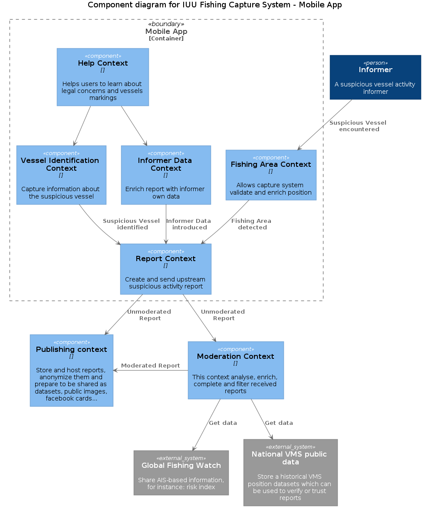

# Table of Contents

1.  [Overview](#orgcbd6f47)
2.  [Report Context](#org0779c90)
    1.  [Overview](#orgd9d80d6)
    2.  [data](#orgea49e53)
    3.  [workflows](#org400bac7)
3.  [Fishing Area Context](#org70b06b4)
    1.  [Overview](#org1429330)
        1.  [Goals](#org58d3f5c)
    2.  [data](#org2125aac)
    3.  [workflows](#org7566898)
        1.  [substeps](#org0ed376f)
4.  [Vessel Identification Context](#org8d42813)
    1.  [Overview](#orge6eceb3)
        1.  [Goals](#org8e7e605)
    2.  [Design trade-offs](#orgd9573f6)
    3.  [data](#orge79bdf3)
5.  [Informer Data Context](#org1fd7bf6)
    1.  [Overview](#orgf7bc09d)
        1.  [Goals](#org08d2d47)
    2.  [data](#org524ae21)
6.  [Help Context](#org88ffd94)
    1.  [Overview](#orgf725c7c)
        1.  [Goals](#orgab9a9dc)
    2.  [data](#orgb727a76)
7.  [Scratch](#orgd97f3e2)

# Overview

# Report Context

## Overview

High sees encounters with alleged ilegal fishing vessels (mainly Asian flag
sheeps) are being reported by artisanal fishing fleet in Calamasur. They usually
don’t have the tools to record these encounters properly, and there is lack of
consensus on what information should be captured.

They usually take place in non network coverage áreas and may last up to 8 days

---

La flota pesquera artesanal denuncia que se producen encuentros en alta mar con
embarcaciones sospechosas de ejercer pesca ilegal. Principalmente flota de
bandera asiática. Carecen de herramientas específicas que les permitan registrar
estos encuentros y no existe un consenso sobre cuál es la información más
valiosa a capturar.

Estos encuentros se producen generalmente en zonas fuera de cobertura móvil y la
estancia en esas zonas puede durar hasta 8 días.

## data

    data Report =
      FishingVessel
      AND NoEmptyList of SuspiciousActivity
      AND InformerData

## workflows

    workflow "ReportSuspiciousActivity" =
      input = EmptyReport
      output (on success) = SuspiciousActivityReported
      output (on error) = InvalidReport
    
    //step 1
    do CheckFields

# Fishing Area Context

## Overview

The project is aimed towards ​​Calamasur. The boundaries of the Exclusive Economic
Zones (EEZ) where the greatest number of encounters take place are defined and
accepted internationally.

Other fishing areas will have problems that will be totally or subtly different
from those of Calamasur, and for which SFP does not currently have agreements or
powers. It may be possible that in future versions of it , these other problems
will be taken in consideration.

All devices are capable of obtaining their geolocation.

---

El proyecto va dirigido al ámbito de Calamasur. Los límites de las zonas
económicas exclusivas (EEZ) donde se producen el mayor número de encuentros
están definidos y aceptados internacionalmente.

Otras zonas de pesca tendrán problemas que serán total o sutilmente diferentes a
los de Calamasur, y sobre los que SFP no tiene actualmente acuerdos o competencias.
No es descartable que en futuras versiones se de soporte a estos otros problemas.

Todos los dispositivos son capaces de obtener su geolocalización.

### Goals

-   Improve the user experience with an interface and business rules adapted to
    the location.
-   Verify device's location capabilities are turned on.
-   Ensure that at the beginning of the process we have a pretty accurate
    position.
-   Minimize the number of non valid reports that will need oversight (From land,
    areas that are not taken in consideration)

---

-   Mejorar la experiencia de usuario con una interfaz y reglas de negocio
    adaptadas a la localización.
-   Comprobar que las capacidades de localización del dispositivo están encendidas.
-   Garantizar que al comienzo del proceso tenemos una posición minimamente
    precisa.
-   Minimizar el número de informes no válidos que moderar (Desde tierra, zonas
    sin competencias&#x2026;)

## data

    data DeviceLocationData =
      Latitude
      AND Longitude
      AND Accurancy
    
    data DesiredAccurancy =
      Meters
    
    data GetFishingAreaInput =
      DeviceLocationData
      AND DesiredAccurancy
    
    data AccurateLocation =
      AccurateLatitude
      AND AccurateLongitude
    
    data SupportedAreas =
      list of SupportedArea
    
    data SupportedArea =
      FishingAreaName
      AND PolygonArea // As in marineregions.org
    
    data SupportedFishingArea =
      CalamasurArea
      OR GenericArea
      OR ...

## workflows

    workflow "GetFishingArea" =
      input: GetFishingAreaInput
      output (on success): SupportedFishingAreaDetected
      output (on error): UnsupportedFishingArea OR InaccurateLocation
    
    //step1
    do CheckLocationAccurancy
      If inaccurate
      return InaccurateLocation
      stop
    
    //step2
    do CheckPosition
      If unsupported
      return UnsupportedFishingArea
      stop
    
    //step3
    return SupportedFishingAreaDetected

### substeps

    substep "CheckLocationAccuracy" =
      input: GetFishingAreaInput
      output (on success): AccurateLocation
      output (on error): InaccurateLocation
    
    substep "CheckPosition" =
      input: AccurateLocation
      dependency: SupportedAreas
      output (on sucess): SupportedFishingArea
      output (on error): UnsupportedFishingArea

# Vessel Identification Context

## Overview

In Calamasur, the alleged illegal fishing vessels are mainly of Asian flag.

It can be particularly difficult to identify Asian ships by their names, since
it exists a great variation in the way Chinese characters are written in Roman
letters, therefore it is mandatory to detect any numbers visible on the hull.

There is lack of consensus regarding the proximity of the encounters and if it
is possible to capture relevant information with a mobile device. However, it
seems unanimous that suspicious vessels are usually very dirty, show unreadable
names and attempts to hide their features.

According to FAO, attempts to hide their features are already a felony,
regardless of the fishing activity they are carrying out same for duplicate
features, or sailing without a flag.

Suspicious vessels carry out an industrial activity, so they are obliged to
broadcast through the AIS radio system. However, the majority of Calamasur craft
vessels do not have AIS receivers whereas the industrial fleets in the area do
have them.

---

En Calamasur las embarcaciones sospechosas de ejercer pesca ilegal son
principalmente de bandera asiática.

Puede ser particularmente difícil identificar los barcos asiáticos por sus
nombres, ya que existe una gran variación en la forma en que se escriben los
caracteres chinos en letras romanas, por lo que capturar cualquier número
visible en el casco es particularmente importante.

Hay diversidad de opiniones respecto a la cercanía de los encuentros y la
capacidad de poder capturar información relevante con el dispositivo móvil. Sin
embargo parece unánime que los buques sospechosos suelen estar muy sucios,
nombre ilegible o intentos de ocultar sus marcas.

Según FAO los intentos de ocultar sus marcas son en si mismo un motivo de denuncia,
independientemente de la actividad pesquera que estén ejerciendo. Lo mismo para
marcas duplicadas, o navegar sin bandera.

Las embarcaciones sospechosas ejercen una actividad industrial, por lo que estan
obligados a emitir por el sistema de radio AIS. Sin embargo las embarcaciones
artesanas de Calamasur en su mayoría no disponen de receptores AIS. Si disponen
de AIS las flotas industriales de la zona.

### Goals

-   Get the most relevant information possible
-   Get alerts prior to obtaining sound and relevant information
-   Educate about the different reportable facts, other than the fishing activity.
-   Try to obtain graphic evidence, even of low quality, where details of the
    construction of the ships are captured.
-   Get to know if the AIS system is non-operative or sending false data
    (spoofing)

---

-   Obtener la información mas relevante posible
-   Obtener avisos aun sin información relevante
-   Educar sobre los diferentes hechos denunciables, mas alla de la actividad
    pesquera.
-   Tratar de obtener pruebas gráficas, aun de calidad baja, donde se capturen
    detalles de la construcción de los buques.
-   Llegar a conocer si el sistema AIS está apagado o enviando datos falsos (spoofing).

## Design trade-offs

TODO: número de fotos permitidas
TODO: número de vídeos

## data

    // Markings
    data IMONumber =
      string 9 numbers
    
    data CallSign =
      string first 3 chars as ITU codes
    
    data Other =
      string
    
    data Marking <a> =
      <a>
      OR <a> MarkingNotVisibleOrHidden
    
    data Markings =
      Marking<CallSign>
      AND Marking<IMONumber>
      AND list of Marking<Others>
    
    
    // AIS Transmission
    data MMSI =
      string 7 numbers
    
    data AISDeclaredActivity =
      Fishing
      OR ToPort
      OR ...
    
    data AISTransmission =
      MMSI
      AND AISCallSign
      AND AISName
      AND AISDeclaredActivity
    
    
    // Vessel
    data FishingVessel =
      Type
      AND Markings
      AND AISTransmission
      AND list of Photos
    
    // Activity
    data SuspiciousActivity =
      EEZFishingActivity
      OR HiddingMarkings
      OR DuplicatedMarkings
      OR SignsOfTampering
      OR Stateless
      OR NotAISSignal
      OR AISSpoofedSignal
      OR Other

# Informer Data Context

## Overview

El usuario o informador será generalmente un patrón de embarcación de pesca
artesanal. Suele ser reticente a desvelar su identidad o a hacer pública la
posición geográfica exacta del encuentro.

La flota artesanal carece de transmisores AIS, pero está en plena implantación
del sistema VMS. La flota industrial si transmite AIS públicamente.

Los dispositivos móviles Android que utilizan permiten obtener, no sólo la
posición, si no también volcados raw de la información de los sistemas de
navegación.

### Goals

-   Extraer el máximo contexto posible del momento de la captura
-   Tener la información necesaria para poder dar veracidad al encuentro
    basándonos en las señales AIS, VMS de la embarcación
-   Extraer los datos necesarios para poder valorar la calidad técnica de la señal
    GNSS del dispositivo móvil.

## data

    data PeruvianVMSIdentifier =
      String as "P-04-00951"
    
    data ChileanVMSIdentifier =
      VesselName
    
    data VMSIdentifier =
      PeruvianVMSId
      OR ChileanVMSId
    
    data InformerDeviceLocation =
      RawGNSSMeasurementsDump
      OR BasicLocation
    
    data InformerAIS =
      MMSINumber
      OR WithoutOrPrivateAIS
    
    data InformerVMS =
      VMSIdentifier
      OR WithoutOrPrivateVMS
    
    data InformerData =
      InformerVMS
      AND InformerAIS
      AND InformerDeviceLocation

# Help Context

## Overview

Application users doesn't know well the law enforcement. Neither mandatory
markings, important markings or international radio systems for indutrial
vessels.

Opportunities to take good pictures are low because mobile device camera
technical specs but also distance, movement, dirty hulls&#x2026;

---

El conocimiento de la legislación por los patrones o usuarios de la aplicación
es bajo. Igualmente lo referido a los sistemas de marcado o de radio
internacionales para flotas industriales.

La posibilidad de conseguir fotografías de buena calidad es baja, debido a las
especificaciones técnicas de las cámaras de los dispositivos móviles, la
distancia, movimientos, suciedad de las embarcaciones&#x2026;

### Goals

-   Educar a los usuarios sobre qué marcas del casco o del puente son importantes
    en la identifiación de un barco.
-   Informar de la localización mas común de las marcas.
-   Informar sobre los detalles constructivos que son mas sencillos de
    fotografiar.
-   Educar sobre las trasngresiones mas habituales en las flotas ilegales.

## data

    data MarkingsHelp =
      Name
      AND Description
      AND list of Examples
      AND list of TypicalLocation
      AND list of ExamplePhotos
    
    data TypicalLocation =
      Stern
      OR Side
      OR Bridge

# Scratch

Si hay una foto general del barco abre la puerta apoder incorporar fotos tomadas
con alguna cámara externa. Si no hay niguna es imposible verificar que
corresponda con el mismo encuentro.

No debo mezclar la definición del barco, los facts, con el estado en el momento
de la captura. Tratar de ocultar una marca, o estar realizando pesca ilegal, es
estado. Pero por ejemplo, tener callsign duplicados? es estado o hechos?

